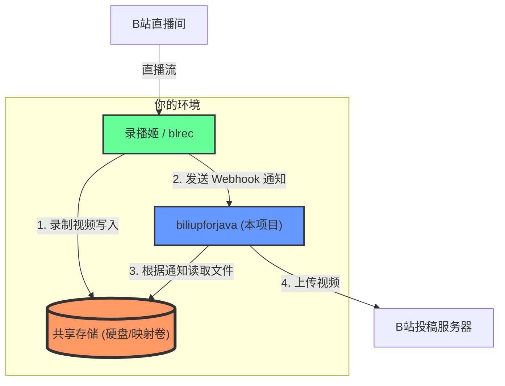

<div align="center">

# BiliUpForJava

**📺 基于 Webhook 的 B站录播自动投稿工具**

[](https://github.com/FQrabbit/biliupforjava/releases)
[](https://hub.docker.com/r/FQrabbit/biliupforjava)

[](https://github.com/FQrabbit/biliupforjava/stargazers)

[](LICENSE)

[功能特性](#-功能特性) • [快速开始](#-快速开始) • [详细配置](#-详细配置) • [系统截图](#-系统截图) • [常见问题](#-常见问题)

</div>

---

## 📖 简介

BiliUpForJava 是一个全自动的 B站录播投稿工具，配合**录播姬**（BililiveRecorder/blrec）使用，通过 Webhook 机制实现录播文件的自动上传和投稿。

> **重要说明**：本程序只负责录播文件的上传投稿，**不支持直播录制功能**，需要配合录播姬使用。

### 💡 适用场景

- 🖥️ NAS / 服务器 24小时录播监控
- 🎬 直播录制后自动投稿
- 💾 边录边传*，节省磁盘空间
- ☁️ 录播文件自动上传至云盘
- 🎨 支持自定义封面和云剪辑

## ✨ 功能特性

| 功能 | 说明 |
|------|------|
| 🎯 **WebUI 配置** | 友好的网页管理界面，无需修改配置文件 |
| 💾 **边录边传** | 支持录制一个文件后上传一个文件，减少硬盘占用 |
| 🖼️ **智能封面** | 支持直播封面和自定义封面 |
| 💬 **弹幕转移** | 可将直播弹幕转移到录播视频（非压制） |
| ✂️ ~~**云剪辑支持**~~| ~~上传到 B站云剪辑平台素材库进行二次创作~~ |
| 📤 **云盘路径支持** | 支持文件处理后移动，配合 rclone/WebDAV 上传云盘 |
| 🐳 **Docker 部署** | 提供 Docker 镜像，支持一键部署 |
| 🖥️ **跨平台** | 支持 Windows、Linux、NAS 等多种环境 |

## 🔄 工作原理



### 工作流程说明

1. **录播姬** 负责监控直播并录制视频文件
2. **录播姬** 通过 Webhook 通知本项目录制完成（携带文件路径）
3. **本项目** 收到通知后读取文件并自动上传到 B站
4. **⚠️ 关键**：录播姬和本项目必须能访问**同一个文件路径**（Docker 部署需映射同一宿主机目录）

---

## 🚀 快速开始

### 前置要求

- Docker 环境（推荐）或 Java 17+ 环境
- 录播姬（BililiveRecorder 或 blrec）
- B站账号

### 方式一：Docker 部署（推荐）

<details open>
<summary><b>展开查看 Docker 部署步骤</b></summary>

#### 📋 容器参数说明

| 参数项 | 容器内默认值 | 推荐设置 | 作用说明 |
|--------|-------------|----------|----------|
| **端口映射** | `80` | `-p 12380:80` | 映射宿主机端口到容器 80 端口 |
| **存储卷** | 无 | `-v /path/to/recordings:/bilirecord` | 挂载录制文件目录（必须与录播姬一致） |
| **内存限制** | 无限制 | `-m 512M` | 限制容器最大内存使用，最低 400MB |
| **时区** | `Asia/Shanghai` | 已内置 | 已在镜像中设置中国时区 |
| **重启策略** | 无 | `--restart always` | 容器异常退出时自动重启 |

#### 🔧 可选 JVM 参数（通过 `JAVA_OPTS` 环境变量）

| 参数 | 默认值 | 推荐值 | 说明 |
|------|-------|--------|------|
| `-Drecord.userName` | 无 | `admin` | Web 管理界面登录用户名 |
| `-Drecord.password` | 无 | `your_password` | Web 管理界面登录密码 |
| `-Dfile.encoding` | 系统默认 | `UTF-8` | **强烈推荐设置**，避免中文乱码 |
| `-Duser.timezone` | `Asia/Shanghai` | `Asia/Shanghai` | 已内置，无需额外设置 |

> ⚠️ **重要提示**
> - 建议添加 `-Dfile.encoding=UTF-8` 参数，避免文件名或日志出现乱码
> - 时区已在 Docker 镜像中设置为 `Asia/Shanghai`，无需额外配置

#### 1️⃣ 拉取镜像

```bash
docker pull FQrabbit/biliupforjava:latest
```

#### 2️⃣ 基础运行（无密码）

```bash
docker run -d \
  --name bup \
  -p 12380:80 \
  -v /path/to/recordings:/bilirecord \
  -m 512M \
  --restart always \
  FQrabbit/biliupforjava:latest
```

#### 3️⃣ 完整配置运行（推荐）

```bash
docker run -d \
  --name bup \
  -p 12380:80 \
  -v /path/to/recordings:/bilirecord \
  -e JAVA_OPTS='-Drecord.userName=admin -Drecord.password=your_password -Dfile.encoding=UTF-8' \
  -m 512M \
  --restart always \
  FQrabbit/biliupforjava:latest
```

> 💡 **路径提示**：`/path/to/recordings` 必须和录播姬的录制目录保持一致

</details>

### 方式二：本地部署

<details>
<summary><b>展开查看本地部署步骤</b></summary>

#### 前置条件
- Java 17 或更高版本
- 下载最新的 WAR 文件：~~[阿里云盘](https://www.aliyundrive.com/s/8n4waHuh5sA)~~ 或 [GitHub Release](https://github.com/FQrabbit/biliupforjava/releases/latest)

#### 运行命令

```bash
java -Dserver.port=12380 \
  -Drecord.work-path=/path/to/recordings \
  -Drecord.userName=你的用户名admin \
  -Drecord.password=你的密码your_password \
  -Duser.timezone=Asia/Shanghai \
  -Dfile.encoding=UTF-8 \
  -jar biliupforjava.war
```
> 🔒 **安全提示**
> - 强烈建议通过 `-Drecord.userName` 和 `-Drecord.password` 参数设置 Web 管理界面的登录密码
> - 如果部署在公网服务器，务必配置强密码或使用 SSH 隧道/VPN 访问
> - 默认无密码模式存在安全风险，任何人都可以访问管理界面


#### Webhook 配置地址

```
录播姬 WebHook v2: http://192.168.x.x:12380/recordWebHook
blrec WebHook: http://192.168.x.x:12380/recordWebHook
```
> **⚠️ 重要提示**
> - ✅ 使用容器名称 `bup`（需配置网络）
> - ✅ 或使用局域网 IP：`http://192.168.x.x:12380/recordWebHook`
> - ❌ 不要使用 `localhost` 或 `127.0.0.1`
> - ❌ 不要使用容器内部 IP


</details>

---

## 📦 详细配置

### 步骤 1：安装录播姬

选择以下任一录播姬：

<details>
<summary><b>选项 A：BililiveRecorder（推荐）</b></summary>

📖 [官方文档](https://rec.danmuji.org/)

```bash
# 拉取镜像
docker pull bililive/recorder:latest

# 运行容器
docker run -d \
  --name brec \
  -v /path/to/recordings:/rec \
  -p 2356:2356 \
  --restart always \
  bililive/recorder
```

**推荐文件名格式：**
```
{{ roomId }}-{{ name }}/{{ json.room_info.live_start_time | time_zone: "Asia/Shanghai" | format_date: "yyyy年" }}/{{ json.room_info.live_start_time | time_zone: "Asia/Shanghai" | format_date: "MM月" }}/{{ json.room_info.live_start_time | time_zone: "Asia/Shanghai" | format_date: "dd号" }}/{{ json.room_info.live_start_time | time_zone: 'Asia/Shanghai' | format_date: "yyyy年MM月dd号-HH点mm分ss秒开播" }}/{{ title }}-{{ "now" | time_zone: 'Asia/Shanghai' | format_date: "yyyy年MM月dd号-HH点mm分ss秒" }}-{{ partIndex | format_number: "000" }}.flv
```

</details>

<details>
<summary><b>选项 B：blrec</b></summary>

📖 [GitHub 仓库](https://github.com/acgnhiki/blrec)

```bash
# 拉取镜像
docker pull acgnhiki/blrec

# 运行容器
docker run -d \
  --name blrec \
  -v /path/to/recordings:/rec \
  -p 2233:2233 \
  --restart always \
  acgnhiki/blrec
```

**推荐文件名格式：**
```
{roomid} - {uname}/{year}年/{month}月/{day}号/{year}年{month}月{day}号{hour}{minute}{second}
```

</details>

### 步骤 2：配置 Docker 网络

为了让录播姬和本项目能够相互通信，需要配置同一网络：

```bash
# 创建网络
docker network create bili-net

# 连接容器到网络
docker network connect bili-net brec  # 或 blrec
docker network connect bili-net bup
```

### 步骤 3：配置 Webhook

#### 在录播姬中配置 Webhook

打开录播姬的 WebUI（默认端口 2356 或 2233），找到 Webhook 配置：

| 录播姬类型 | Webhook URL |
|-----------|-------------|
| BililiveRecorder | `http://bup/recordWebHook` |
| blrec | `http://bup/recordWebHook` |

> **⚠️ 重要提示**
> - ✅ 使用容器名称 `bup`（需配置网络）
> - ✅ 或使用局域网 IP：`http://192.168.x.x:12380/recordWebHook`
> - ❌ 不要使用 `localhost` 或 `127.0.0.1`
> - ❌ 不要使用容器内部 IP

### 步骤 4：配置本项目

1. 访问 Web 管理界面：`http://localhost:12380`
2. 首次使用请先登录（默认无密码，建议配置）
3. 进入**用户页面**进行 B站账号登录
4. 配置**直播间设置**：
   - 是否自动上传
   - 是否删除源文件
   - 上传用户选择
   - 标题、标签等投稿信息

---

## 🎨 系统截图

<details>
<summary><b>点击查看界面截图</b></summary>

 


</details>

---

## ❓ 常见问题

<details>
<summary><b>Q: Webhook 通知失败怎么办？</b></summary>

**A:** 检查以下几点：
1. 确认两个容器在同一 Docker 网络中
2. 在浏览器访问 Webhook URL 测试连通性
3. 查看录播姬日志是否有错误信息
4. 使用局域网 IP 而非 localhost

</details>

<details>
<summary><b>Q: 上传失败或卡住怎么办？</b></summary>

**A:** 可能的原因：
- B站 Cookie 过期，需重新登录
- 网络不稳定，检查上传带宽
- 文件过大，检查磁盘空间
- 查看日志获取详细错误信息

</details>

<details>
<summary><b>Q: 如何配置路径映射？</b></summary>

**A:** 确保路径一致性：
```
宿主机路径: /data/recordings
录播姬映射: /data/recordings:/rec
本项目映射: /data/recordings:/bilirecord
```
或在 Web 界面配置路径替换规则

</details>

<details>
<summary><b>Q: 支持多账号投稿吗？</b></summary>

**A:** 支持！在用户页面可以添加多个 B站账号，并在房间配置中选择对应的投稿账号。

</details>

<details>
<summary><b>Q: 内存占用多少？</b></summary>

**A:** 
- 最低需求：400MB
- 推荐配置：512MB 或更高
- 可通过 `-m` 参数限制：`-m 512M`

</details>

---

## 💬 交流与支持

- **QQ 群**：697605055 <a target="_blank" href="https://qm.qq.com/cgi-bin/qm/qr?k=kBA4u6rVFe_n2XjyYGx94CgTh3-KWM5T&jump_from=webapi&authKey=nhTa8F4D31bovL/ZwEfX5Qt148AyzJKCD4cC0+6ew/Y8bJfcf6aJKxtqXPUjQpwx">
  </a>

- **问题反馈**：[GitHub Issues](https://github.com/FQrabbit/biliupforjava/issues)
- ~~**下载地址**：[阿里云盘](https://www.aliyundrive.com/s/8n4waHuh5sA)~~


---

## 🔗 相关项目

| 项目 | 说明 |
|------|------|
| [BililiveRecorder](https://github.com/BililiveRecorder/BililiveRecorder) | mikufans 录播姬 |
| [blrec](https://github.com/acgnhiki/blrec) | 另一款优秀的 B站录播工具 |

---

## 📄 许可证

本项目采用 [LICENSE](LICENSE) 许可证。

---

## ⭐ Star History

如果这个项目对你有帮助，欢迎给个 Star ⭐

[](https://star-history.com/#FQrabbit/biliupforjava&Date)

---

<div align="center">

**Made with ❤️ for biliupforjava**

</div>
