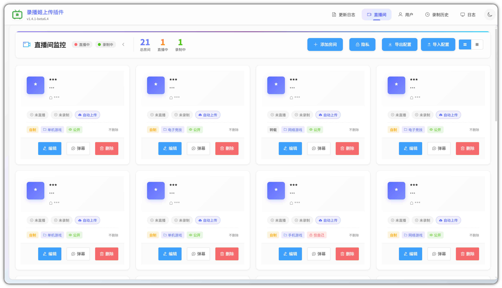
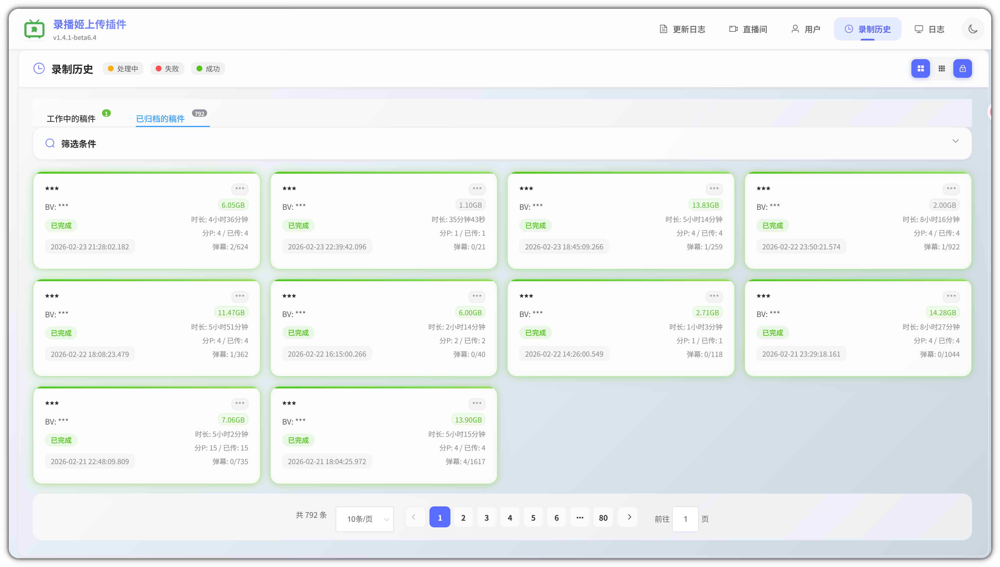
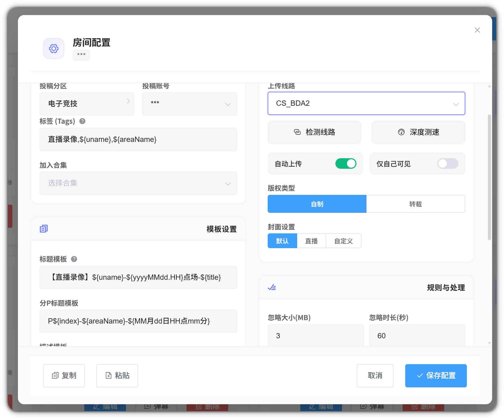
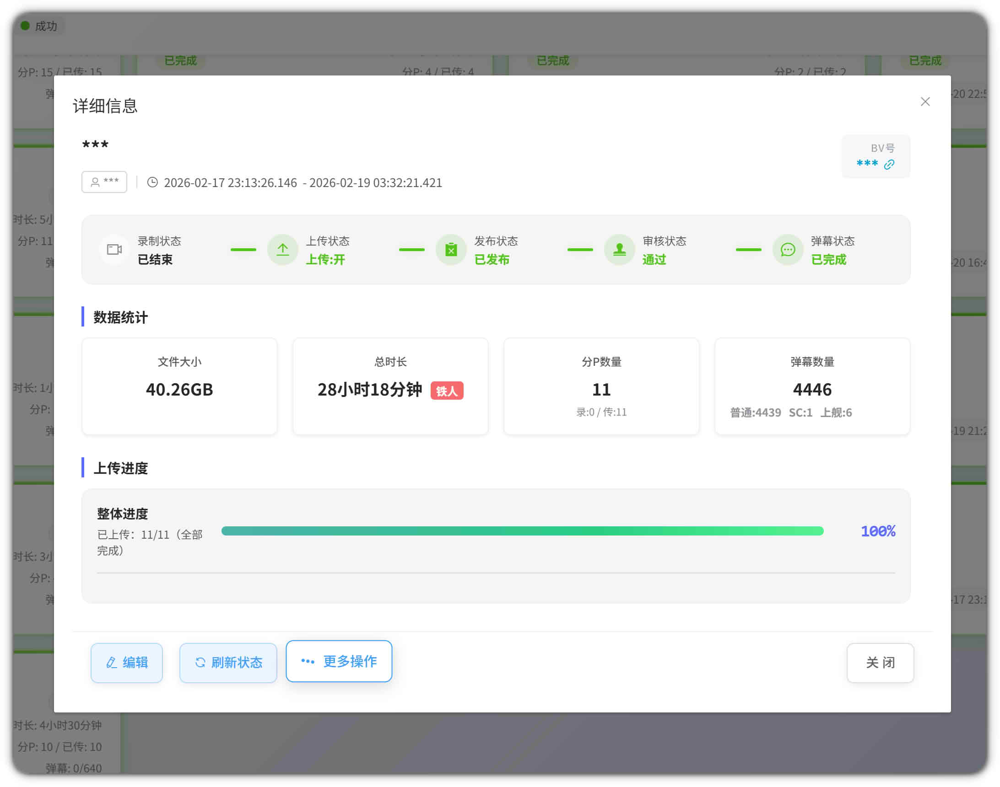
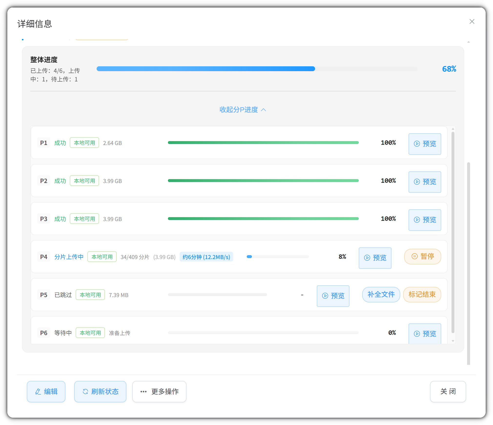
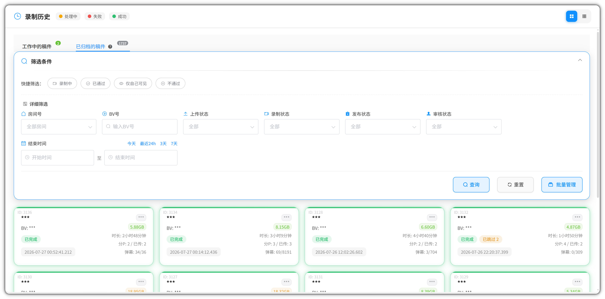

<p align="center">
  
</p>

<h1 align="center">BiliUpForJava</h1>

<p align="center"><strong>录完即传，传完即投</strong></p>
<p align="center">连接录播姬与 B 站投稿，让录制完成后的重复工作自动接力</p>

<p align="center">
  <a href="#五分钟跑起来"><strong>五分钟跑起来</strong></a>
  ·
  <a href="https://github.com/FQrabbit/biliupforjava/releases/latest"><strong>下载最新版</strong></a>
  ·
  <a href="#看看实际界面"><strong>看看界面</strong></a>
  ·
  <a href="./Doc/部署与配置.md"><strong>完整文档</strong></a>
</p>

<p align="center">
  <a href="https://github.com/FQrabbit/biliupforjava/releases"></a>
  <a href="https://hub.docker.com/r/fqrabbit/biliupforjava"></a>
  <a href="https://github.com/FQrabbit/biliupforjava/releases"></a>
  <a href="./LICENSE"></a>
</p>

> BiliUpForJava 负责录播文件的上传与投稿，不负责直播录制。使用前需要先准备 [BililiveRecorder](https://github.com/BililiveRecorder/BililiveRecorder) 或 [blrec](https://github.com/acgnhiki/blrec)

[](./Doc/Screenshot/room.jpg)

<p align="center"><em>一个页面看清直播、录制与自动上传状态</em></p>

## 录完之后，这段流程交给它


BiliUpForJava 通过 Webhook 接收录制事件，读取录播姬写入的文件，再按房间配置完成上传和投稿

**最关键的前提：** 录播姬写入的文件，必须能被 BiliUpForJava 从自己的“工作路径”中找到。Windows 用户要选中同一个真实录制目录；Docker 用户还要对齐宿主机挂载目录、容器内目录与 `record.work-path`

## 它能替你做什么

<table>
  <tr>
    <td width="50%" valign="top">
      <strong>录完自动接上</strong><br>
      录播姬发来 Webhook 后自动处理文件，支持一段录完传一段，减少等待和磁盘压力
    </td>
    <td width="50%" valign="top">
      <strong>上传过程看得见</strong><br>
      通过 WebUI 查看直播间、录制历史、稿件状态和分 P 上传进度，不必只盯着日志
    </td>
  </tr>
  <tr>
    <td width="50%" valign="top">
      <strong>投稿规则按房间配置</strong><br>
      为不同直播间选择投稿账号、标题、标签和封面，也可以转移直播弹幕(量大不推荐)
    </td>
    <td width="50%" valign="top">
      <strong>文件处理留有后路</strong><br>
      处理完成后可移动文件，配合 rclone、WebDAV 等工具继续归档到云盘
    </td>
  </tr>
</table>

适合放在 NAS、家用服务器或长期运行的录播主机上，也支持 Windows、Linux 与 Docker 环境

## 五分钟跑起来

### Windows EXE（推荐）

Windows 版本不需要安装 Java 或 Docker。开始前只需要准备：

- 64 位 Windows 系统
- BililiveRecorder 或 blrec
- 一个可以正常投稿的 B 站账号
- 录播姬实际保存视频的文件夹
- 至少为本项目预留 1 GB 可用RAM(War文件下需求，exe只要200MB内)

#### 1. 下载并完整解压

前往 [GitHub Releases](https://github.com/FQrabbit/biliupforjava/releases/latest)，下载名称中带有 `Windows-x64.zip` 的压缩包

如果当前版本暂未提供 Windows ZIP，可以先使用 [部署与配置文档](./Doc/部署与配置.md) 中的 Docker 或 WAR 方式

把压缩包完整解压到一个固定目录，不要直接在压缩包里运行，也不要只把 EXE 单独拖出来。DLL、`ffmpeg.exe` 和 `licenses` 目录都应与主程序放在一起

#### 2. 完成首次运行向导

1. 双击解压目录中的 `biliupforjava-版本号.exe`
2. 第一次运行会自动打开初始化向导，通常是 `http://localhost:8080/html/setup.html`；如果没有自动打开，以程序窗口显示的实际地址为准
3. 服务端口可以保留默认的 `44122`
4. **工作路径请选择录播姬实际保存视频的根目录**
5. 建议同时设置管理员账号和密码
6. 保存后会在 EXE 同级目录生成 `application.yml`，程序随后自动退出
7. 再次双击 EXE，程序才会按刚才的配置正常启动

正常运行期间请保持程序窗口开启，关闭窗口就会停止服务

> [!IMPORTANT]
> “工作路径”不是 EXE 所在目录，也不是随便新建的缓存目录。比如录播文件实际位于 `D:\录播\主播名\视频.flv`，这里就应该填写 `D:\录播`

#### 3. 登录账号并连接录播姬

1. 打开 `http://localhost:44122`；如果向导里改过端口，请使用修改后的端口
2. 进入用户页面，登录 B 站账号
3. 添加或编辑直播间，设置自动上传与投稿信息
4. 在录播姬中填写 Webhook 地址

录播姬也直接运行在这台 Windows 电脑上时，Webhook 可以填写：

```text
http://127.0.0.1:44122/recordWebHook
```

如果录播姬运行在 Docker 中，`127.0.0.1` 指向的是录播姬容器自己，应改用这台 Windows 电脑的局域网 IP，例如：

```text
http://192.168.x.x:44122/recordWebHook
```

需要安装录播姬时，可以查看 [录播姬容器安装文档](https://rec.danmuji.org/install/container/)；Webhook 的事件说明见 [录播姬 Webhook 文档](https://rec.danmuji.org/reference/webhook/)

**安全提醒：** 不要把无密码的管理界面直接暴露到公网。公网访问请使用强密码，并配合内网、VPN、SSH 隧道或带身份验证的反向代理

NAS、Linux、Docker 和 WAR 的完整步骤统一放在 [部署与配置文档](./Doc/部署与配置.md) 中，README 不再重复展开

## 看看实际界面

### 每一份录播现在走到了哪里

[](./Doc/Screenshot/history.jpg)

<p align="center"><em>工作中、失败与已归档稿件分开呈现</em></p>

<details>
<summary><strong>展开查看房间设置、历史详情和筛选</strong></summary>

### 每个房间都有自己的投稿规则



### 稿件信息与处理结果集中查看



### 分 P 上传进度一目了然



### 需要的稿件可以快速筛出来



</details>

## 完整使用说明

| 想了解什么 | 从这里开始 |
|---|---|
| Windows EXE 下载与首次运行 | [五分钟跑起来](#五分钟跑起来) |
| Docker、WAR、路径映射、网络与 Webhook 配置 | [部署与配置](./Doc/部署与配置.md) |
| 在 Windows 上自行编译 EXE | [EXE 编译指南](./Doc/exe编译指南.md) |
| 下载最新版与查看更新内容 | [GitHub Releases](https://github.com/FQrabbit/biliupforjava/releases) |
| 提交问题或功能建议 | [GitHub Issues](https://github.com/FQrabbit/biliupforjava/issues) |

## 常见问题

<details>
<summary><strong>Webhook 通知失败怎么办？</strong></summary>

1. 两个程序都直接运行在同一台 Windows 电脑时，使用 `http://127.0.0.1:44122/recordWebHook`
2. 录播姬在 Docker、BiliUpForJava 使用 EXE 时，使用 Windows 主机的局域网 IP，不要使用容器里的 `127.0.0.1`
3. 两个程序都在 Docker 时，把容器接入同一网络并使用 `http://bup/recordWebHook`
4. 确认端口与初始化向导中的设置一致，并检查 Windows 防火墙是否允许访问
5. 不要填写 BiliUpForJava 容器容易变化的临时内部 IP
6. 查看录播姬日志，确认通知是否实际发出

</details>

<details>
<summary><strong>上传失败或一直没有进度怎么办？</strong></summary>

- 检查 B 站登录状态或 Cookie 是否过期
- 检查上传网络、磁盘空间和录制文件是否完整
- 在录制历史中打开稿件详情，再结合日志查看具体错误

</details>

<details>
<summary><strong>支持多个 B 站账号吗？</strong></summary>

支持。可以在用户页面添加多个账号，再为不同直播间选择对应的投稿账号

</details>

<details>
<summary><strong>需要多少内存？</strong></summary>

- 建议至少为 BiliUpForJava 预留 **1 GB 可用内存**
- Docker 推荐使用 `-m 1g`，不建议再限制到 512 MB (原分支的需求)
- Windows EXE 平时占用可能较低，但上传、封面和 FFmpeg 等任务会出现短时高峰，不要按空闲时占用估算机器容量 (EXE相比WAR的CPU占用时间会更短)
- 同时管理很多房间或并行处理多个任务时，应继续增加可用内存

</details>

## 交流与相关项目

- QQ 群：`697605055` <a target="_blank" href="https://qm.qq.com/cgi-bin/qm/qr?k=kBA4u6rVFe_n2XjyYGx94CgTh3-KWM5T&jump_from=webapi&authKey=nhTa8F4D31bovL/ZwEfX5Qt148AyzJKCD4cC0+6ew/Y8bJfcf6aJKxtqXPUjQpwx"></a>
- 问题反馈：[GitHub Issues](https://github.com/FQrabbit/biliupforjava/issues)
- 录制工具：[BililiveRecorder](https://github.com/BililiveRecorder/BililiveRecorder) / [blrec](https://github.com/acgnhiki/blrec)

## 许可证

本项目采用 [Apache License 2.0](./LICENSE) 开源

<details>
<summary><strong>查看 Star History</strong></summary>

[](https://www.star-history.com/?repos=FQrabbit%2Fbiliupforjava&type=date&legend=top-left)


</details>

<p align="center"><strong>让录播从存储到投稿，少一点重复操作</strong></p>
